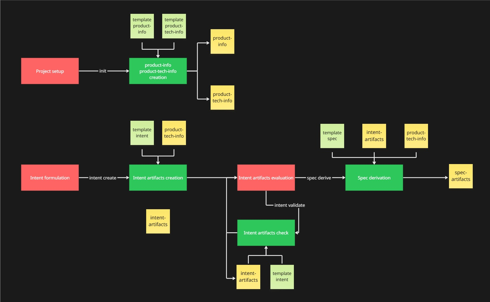
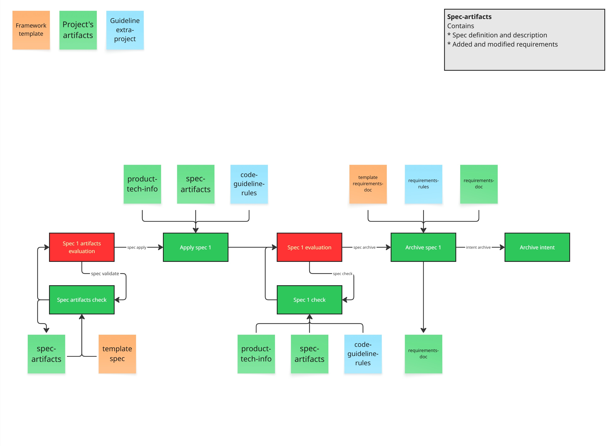

# Praxis

```
 ███████████                                   ███         
░░███░░░░░███                                 ░░░          
 ░███    ░███ ████████   ██████   █████ █████ ████   █████ 
 ░██████████ ░░███░░███ ░░░░░███ ░░███ ░░███ ░░███  ███░░  
 ░███░░░░░░   ░███ ░░░   ███████  ░░░█████░   ░███ ░░█████ 
 ░███         ░███      ███░░███   ███░░░███  ░███  ░░░░███
 █████        █████    ░░████████ █████ █████ █████ ██████ 
░░░░░        ░░░░░      ░░░░░░░░ ░░░░░ ░░░░░ ░░░░░ ░░░░░░  
```

**Praxis** is a development framework that bridges **Intent‑Driven Development (IDD)** and **Spec‑Driven Development (SDD)** into a single, coherent workflow.

It relays on [Intended](https://github.com/Nom-nom-hub/Intended) and [OpenSpec](https://github.com/Fission-AI/OpenSpec).

Praxis helps teams start from *why* they are building something, derive *what* must be built in the form of explicit specifications, and continuously verify that the *how* (the code) never diverges from the original intent.

It is designed to be:

* **AI‑native** (usable from AI chats inside modern IDEs)
* **CLI‑first** (works without any IDE or AI integration)
* **Intent‑centric** (intent is the primary source of truth)

---

## Core Concepts

### Intent

An **Intent** describes the purpose, value, and constraints of a feature or system.
It answers the question:

> *Why are we building this?*

Intents are technology‑agnostic and do not describe APIs, UI, or implementation details.

---

### Specification (Spec)

A **Specification** is a formal, verifiable description derived from an Intent.
It answers the question:

> *What must the system do to satisfy the intent?*

Specs act as contracts and can be translated into:

* behavioral rules
* acceptance criteria
* API contracts
* test cases

---

### Drift Detection

Praxis continuously checks for **semantic drift**:

* specs that no longer satisfy the intent
* code that implements features not justified by any intent

---

## What Praxis Provides

### 1. Intent Management

* Create, update, and validate intents
* Enforce intent structure and clarity
* Track intent evolution over time

### 2. Intent Modeling

* Extract capabilities, events, and states from intents
* Provide a bridge between intent and specification

### 3. Spec Derivation

* Generate initial specifications from intents
* Maintain traceability between intents and specs
* Support manual refinement without losing intent linkage

### 4. Spec Validation

* Lock specs as formal contracts
* Validate implementations against specs
* Detect missing or incomplete implementations

### 5. Drift Analysis

* Detect features not backed by intent
* Detect intents no longer satisfied by current specs

### 6. AI & IDE Integration

* Slash‑command friendly design
* CLI commands that can be mapped to IDE AI chats
* Optional exposure as a local command server (e.g. MCP‑style)

## Suggested workflow





- `praxis init my-project` - Initializing Praxis on a project 
  
  This command will create the product-info and product-tech-info artifacts. The user should review and, if necessary, modify the contents of the documents.

- `praxis intent create <intent-description>` - Intent creation
  
  This command will create a new intent based on the description provided by the user. The intent will be created in the `wip` directory of the `.praxis/intents` folder. User must review and, if necessary, modify the contents of the intent.

- `praxis intent validate <intent-id>` - Intent validation
  
  This command will validate the intent, after the user edit, for completeness and consistency.

- `praxis spec derive --from-intent <intent-id>` - Spec derivation from intent
  
  This command will derive a spec (or more than one) from an intent. The specification will be created in the `wip` directory of the `.praxis/specs` folder. User must review and, if necessary, modify the contents of the specification.
  Specs are generated in **draft** status.

- `praxis spec validate <spec-id>` - Spec validation
  
  User can edit the spec. Once the user is satisfied with the spec, they can validate it. This command will validate the spec for completeness and consistency.

- `praxis spec apply <spec-id>` - Spec implementation
  
  This command will apply the spec to the project. It will send spec to AI to implement it.

- `praxis spec check <spec-id>` - Check if implementation satisfies spec
  
  This command will check if the implementation satisfies the spec.

- `praxis spec archive <spec-id>` - Spec archive
  
  This command will archive the spec. It will move the spec from the `wip` directory to the `archive` directory.

- `praxis intent archive <intent-id>` - Intent archive
  
  This command will archive the intent. It will move the intent from the `wip` directory to the `archive` directory. Usually, this is called then all specs derived from the intent are archived.

## Folder structure

```
.praxis/
├── intents/
│   ├── wip/             # Work-in-progress intents
│   └── archive/         # Archived intents
├── specs/               # Specifications (OpenSpec)
│   ├── wip/             # Work-in-progress specs
│   └── archive/         # Archived specs
└── templates/           # Templates for intents and specs
```

## Command available 

✅ - already implemented
❌ - not yet implemented
❔ - not sure if it will be implemented

List is a wip and may change in future.

### Intent Commands

|Command|Description|Status/Version|
|-|-|-|
|`praxis init <project-name>`|Initialize a new project to be used with Praxis. Templates are provided in the `templates` directory.|✅|
|`praxis intent create <intent-description>`|Create a new intent.|✅|
|`praxis intent update <intent-id>`|Update an existing intent.|❔​|
|`praxis intent validate <intent-id>`|Validate all intents for completeness and consistency.|✅|
|`praxis intent list`|List all defined intents.|✅|

---

### Intent Modeling Commands

|Command|Description|Status/Version|
|-|-|-|
|`praxis intent model <intent-id>`|Generate or update the intent model (capabilities, events, states).|❔​|

---

### Specification Commands

|Command|Description|Status/Version|
|-|-|-|
|`praxis spec derive --from-intent <intent-id>`|Generate initial specifications from an intent.|✅|
|`praxis spec refine <spec-id>`|Manually refine a specification while preserving intent traceability.|❔​|
|`praxis spec validate <spec-id>`|Validate specs for internal consistency and completeness.|✅|
|`praxis spec apply <spec-id>`|Implement a specification in code.|✅|
|`praxis spec archive <spec-id>`|Archive a specification implemented.|✅|
|`praxis spec delete <spec-id>`|Delete a specific spec.|✅|
|`praxis spec delete --from-intent <intent-id>`|Delete all specs generated from an intent.|❌|
|`praxis spec lock <spec-id>`|Lock a specification as a formal contract.|❔​|
|`praxis spec list --from-intent <intent-id>`|List all specifications and their associated intents.|✅|
|`praxis spec check`|Verify implementation compliance against locked specs.|❔​|

---

### Analysis Commands

|Command|Description|Status/Version|
|-|-|-|
|`praxis analyze impact --from-intent <intent-id>`|Analyze the impact of changes to an intent on specs and code.|❔​|
|`praxis analyze drift`|Detect intent/spec/code drift.|❔​|

---

### Integration & Runtime Commands

|Command|Description|Status/Version|
|-|-|-|
|`praxis serve`|Expose Praxis commands through a local service for IDE or AI integration.|✅|
|`praxis agent broker`|Start an embedded MQTT broker for distributed task management.|✅|
|`praxis commands`|List all available commands in machine‑readable form.|❔​|

---

## Background Agent & Distributed Architecture

Praxis includes a standalone background agent (daemon) that can execute long-running tasks asynchronously. It supports two modes of operation:

1.  **Local Mode (File-based)**: Simple setup for a single machine using standard file watch polling.
2.  **Distributed Mode (MQTT)**: Scalable architecture for multiple parallel agents using an MQTT message queue.

### Starting the Agent

To start the background agent, run:

```bash
praxis serve
```

By default, this starts the agent in the mode defined in your `.praxisrc.json`.

### Distributed Mode & Embedded Broker

In distributed mode, agents connect to an MQTT host to receive tasks via **MQTT 5 Shared Subscriptions** (competing consumers). This allows horizontal scaling where multiple agents can share the workload.

Praxis includes an **embedded MQTT broker** for easy development:

```bash
praxis agent broker --port 1883
```

You can configure the agent to **auto-start** the internal broker when `praxis serve` is called by setting `autoStart: true` in your configuration.

### Configuration (`.praxisrc.json`)

The agent behavior is controlled via a central configuration file. Use `praxis init` to configure it interactively.

```json
{
  "agent": {
    "enabled": true,
    "mode": "mqtt",
    "mqtt": {
      "type": "internal",
      "host": "localhost",
      "port": 1883,
      "autoStart": true
    }
  }
}
```

### IDE Integration (MCP)

The agent communicates using the **Model Context Protocol (MCP)** when running via `praxis serve`. This allows any MCP-compatible AI (Claude Desktop, Cursor, Isaac) to:
- List active background tasks.
- Start long-running operations (like drift analysis).
- Subscribe to progress updates.

#### Available MCP Tools

| Tool | Description | Parameters |
|------|-------------|------------|
| `list_tasks` | List all current background tasks and their status. | None |
| `start_drift_detection` | Triggers a background drift analysis. | `id` (required): Unique task identifier. |
| `get_task_status` | Retrieves progress and status of a specific task. | `id` (required): Task identifier. |

---

## Slash Command Usage (IDE / AI Chat)

When integrated into an IDE or AI‑enabled editor, Praxis commands can be invoked as slash commands:

```
/praxis-intent-create
/praxis-spec-derive
/praxis-intent-check
```

The underlying behavior is identical to the CLI.

---

### How Praxis Fits into Daily Development

* **Before coding**: intents and specs are defined and validated
* **During coding**: specs act as executable and contractual guidance
* **After changes**: drift detection ensures alignment with original intent

This allows Praxis to integrate seamlessly with existing workflows such as:

* Agile / Scrum
* TDD / BDD
* CI/CD pipelines

---

## Design Philosophy

* **Intent is sacred**: everything must trace back to a reason.
* **Specs are contracts**: informal requirements are not enough.
* **Code must justify itself**: no feature without intent.
* **AI is an assistant, not the authority**: Praxis remains deterministic and auditable.

---

## Installation

Praxis is written in **TypeScript** and distributed as a **Node.js CLI**.

### Prerequisites

* Node.js **>= 18**
* npm (or compatible package manager)

You can verify your environment with:

```
node --version
npm --version
```

---

### Install (Global)

To install Praxis globally and make the `praxis` command available system-wide:

```
npm install -g @intoinside/praxis
```

After installation, verify it works:

```
praxis --help
```

or 

```
praxis --version
```

---

### Using with IDEs and AI Chats

When installed locally or globally, Praxis commands can be mapped to:

* IDE extensions (e.g. VS Code)
* AI chat slash commands
* local tool servers (e.g. via `praxis serve`)

The installation method does not change Praxis behavior; it only affects how commands are invoked.

---

## Status

Praxis is under active development.
APIs, command names, and file formats may evolve.
